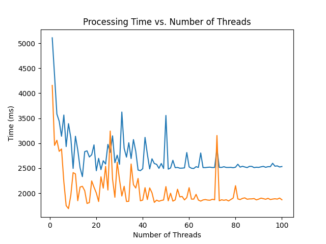
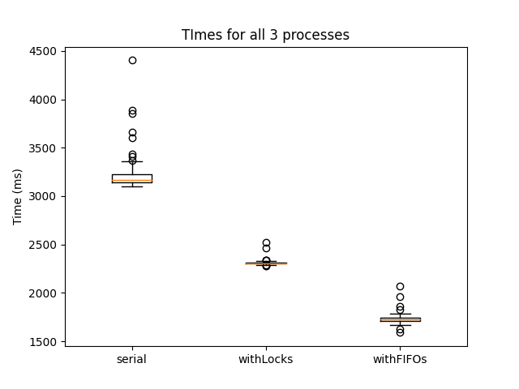

# COMP 3430 - Assignment 2

## Compilation & Execution

```shell
make        # compile all executables & generate folders
make clean  # remove compiled executables & remove folders
```

```shell
# Question 1
./serial ~comp3430/shared/a2_files/*.txt
# Question 2
./withLocks numWorkers ~comp3430/shared/a2_files/*.txt
# Question 3
./withFIFOs numWorkers ~comp3430/shared/a2_files/*.txt
```

**numWorkers** must be a numeric value indicating the number of worker threads to generate.

Additionally, for questions 1 & 2, the main process uses a Job buffer/queue to supply the worker threads with Jobs. By default the buffer size is 10, but can be changed by editing the value **BUFFER_SIZE** in *a2Utils*:

```c
// Global Constants ===================================================================

#define NUM_OUTPUTS 27  // number of output files (a-z + other)
#define BUFFER_SIZE 10  // size of Job Buffer

#define MAX_WORD 100    // max character count for words in input files
#define MAX_NAME 100    // max character count for input file names
```

## Other files

The file *a2Utils.c* contains central code for all 3 questions (plus a bit extra). There is also a header file *a2Utils.h* so that it can be included as a library in each of the questions 'main' functions.

The shell script *test.sh* and python scripts *graph.py* were used to gather the data and plot graphs. The graphs have been included in this *README.md* but can also be found in the **./graphs** folder.

## Temp Folders

Temporary *output*, *fifo*, and *log* folders can be generated by running `make folders`. By default they are generated in:

```
/tmp/ronaldk1/output
/tmp/ronaldk1/fifo
/tmp/ronaldk1/log
```

This can be changed by editing the values **outputDir** and **fifoDir** in *a2Utils*:

```c
// Global Variables ===================================================================

const char outputDir[] = "/tmp/ronaldk1/output/";
const char fifoDir[] = "/tmp/ronaldk1/fifo/";
const char logDir[] = "/tmp/ronaldk1/log/";
```

## Report

The results of running *withLocks.c* (blue) and *withFIFOs.c* (orange) with 1-100 workers can be seen in the line graph below. The general trend is that as the number of workers increases, the total time decreases. Initially it drops quite quickly, after which it levels out. As more and more workers are added the average time becomes much more stable. This makes sense, as when more workers are added initially they can handle more workload. Eventually the producer (main thread) become the bottle neck and added more workers doesn't increase the productivity, this happens around **10** workers (I think this likely correlates to the size of job buffer and cores on the CPU). However, as more and more workers are continued to be added, they are better able to handle the invariance and randomness introduced by the OS scheduler, thus the average time to completion stablizes, this happens around **80** or so workers. Thus, I think the optimal number of workers is **10** in order to increase productivity while minimizing resource usage.



The timing results of running all 3 programs as be seen in the boxplots below. *serial.c* ran with a mean time of **3.2**s, *withLocks.c* with a mean time of **2.3**s, and *withFIFOs.c* with a mean time of **1.7**s. Naturally, adding concurrency should speed things up, so it makes sense that *withLocks.c* was faster than *serial.c*. Additionally, by using FIFOs we elimate the extra steps of aquiring locks and are able to make atomic writes so that no worker is ever blocked waiting to write. So it makes sense that *withFIFOs.c* would be even faster than *withLocks.c*.

Thus, Hypothesis 2 is true:

> Using FIFOs and to handle concurrency is the fastest (using your optimal number of worker threads)


